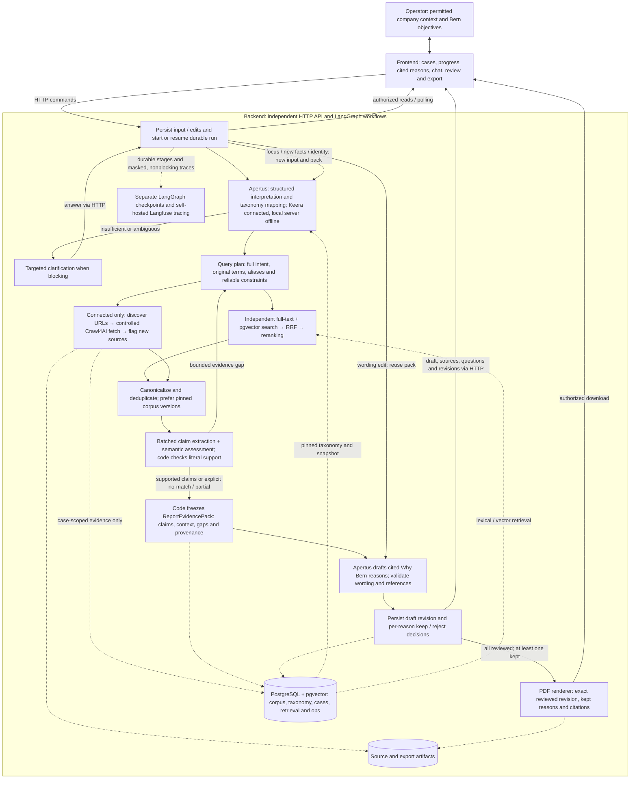

```mermaid
flowchart TB
  USER["Operator: permitted company context and Bern objectives"]
  UI["Frontend: cases, progress, cited reasons, chat, review and export"]
  USER <--> UI
  subgraph BACKEND["Backend: independent HTTP API and LangGraph workflows"]
    API["Persist input / edits and start or resume durable run"]
    INT["Apertus: structured interpretation and taxonomy mapping; Keera connected, local server offline"]
    ASK["Targeted clarification when blocking"]
    PLAN["Query plan: full intent, original terms, aliases and reliable constraints"]
    DBSEARCH["Independent full-text + pgvector search → RRF → reranking"]
    WEB["Connected only: discover URLs → controlled Crawl4AI fetch → flag new sources"]
    MERGE["Canonicalize and deduplicate; prefer pinned corpus versions"]
    VALID["Batched claim extraction + semantic assessment; code checks literal support"]
    PACK["Code freezes ReportEvidencePack: claims, context, gaps and provenance"]
    DRAFT["Apertus drafts cited Why Bern reasons; validate wording and references"]
    REVIEW["Persist draft revision and per-reason keep / reject decisions"]
    PDF["PDF renderer: exact reviewed revision, kept reasons and citations"]
    STORE[("PostgreSQL + pgvector: corpus, taxonomy, cases, retrieval and ops")]
    ART[("Source and export artifacts")]
    OBS["Separate LangGraph checkpoints and self-hosted Langfuse tracing"]
    API --> INT
    INT -->|"insufficient or ambiguous"| ASK
    ASK -->|"answer via HTTP"| API
    INT --> PLAN
    PLAN --> DBSEARCH
    PLAN --> WEB
    DBSEARCH --> MERGE
    WEB --> MERGE
    MERGE --> VALID
    VALID -->|"supported claims or explicit no-match / partial"| PACK
    VALID -->|"bounded evidence gap"| PLAN
    PACK --> DRAFT --> REVIEW
    REVIEW -->|"all reviewed; at least one kept"| PDF
    API -->|"wording edit: reuse pack"| DRAFT
    API -->|"focus / new facts / identity: new input and pack"| INT
    STORE -. "pinned taxonomy and snapshot" .-> INT
    STORE -. "lexical / vector retrieval" .-> DBSEARCH
    WEB -. "case-scoped evidence only" .-> STORE
    WEB -.-> ART
    PACK -.-> STORE
    REVIEW -.-> STORE
    PDF -.-> ART
    API -. "durable stages and masked, nonblocking traces" .-> OBS
  end
  UI -->|"HTTP commands"| API
  API -->|"authorized reads / polling"| UI
  REVIEW -->|"draft, sources, questions and revisions via HTTP"| UI
  PDF -->|"authorized download"| UI
```
